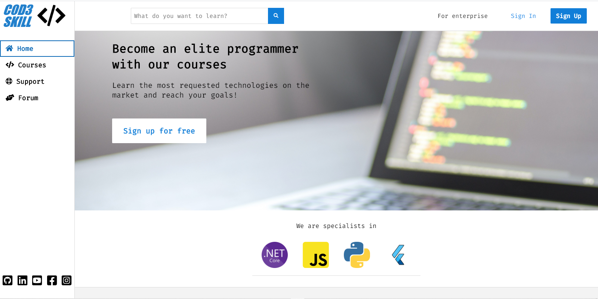
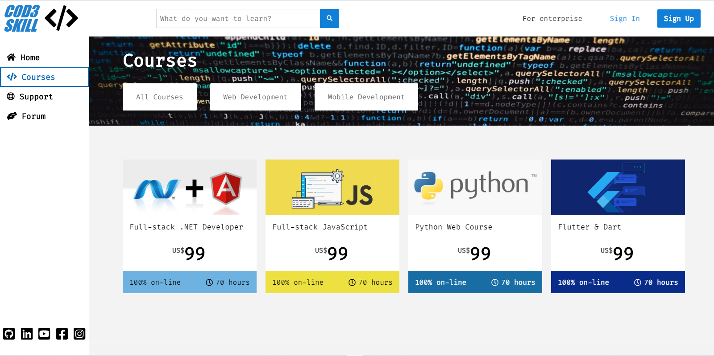
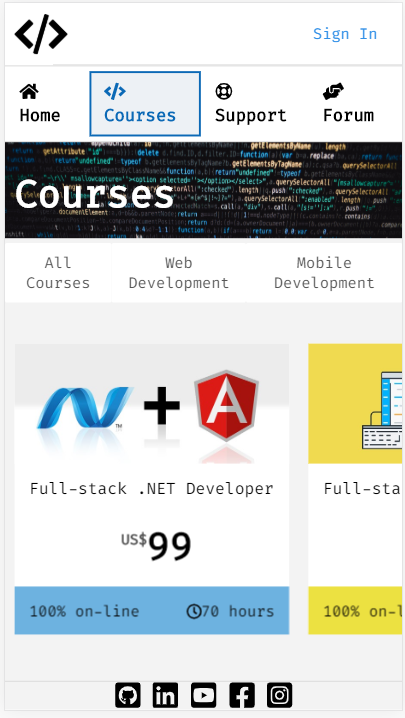

# codeskill-courses

## PC

## Mobile

## About this Project
 
This project was carried out with the intention of integrating HTML, CSS and JavaScript technologies and, mainly, to apply the Ajax development technique in a project.

I will be very happy if you can provide me with any feedback on the project, code, structure or anything you can report that can make me a better developer!

Send me an email: g2_ribeiro@hotmail.com

Connect with me on [LinkedIn](https://www.linkedin.com/in/gustavo-ribeiro-488b4a17a/)

## How to run the project

To execute the project just follow the following steps:

  1. Download or clone the project using the __git clone__;
  2. Open the project folder in VSCODE;
  3. At the VSCODE terminal, use the __npm i__ command to install the dependencies;
  4. After installing the dependencies, use the __npm start__ command to start the server;
  5. Open the browser of your choice and access address __localhost:8080__.
